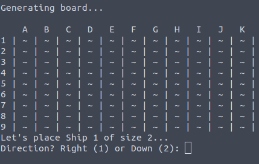
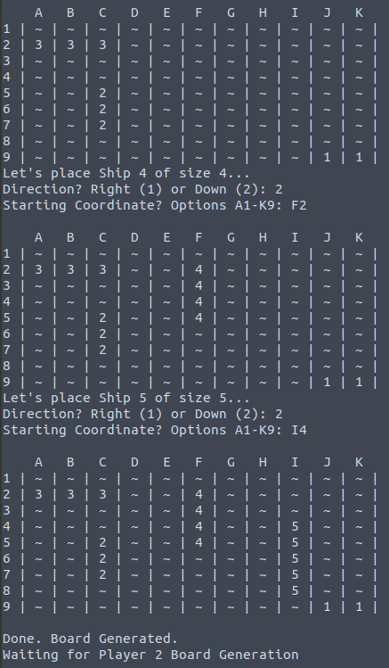
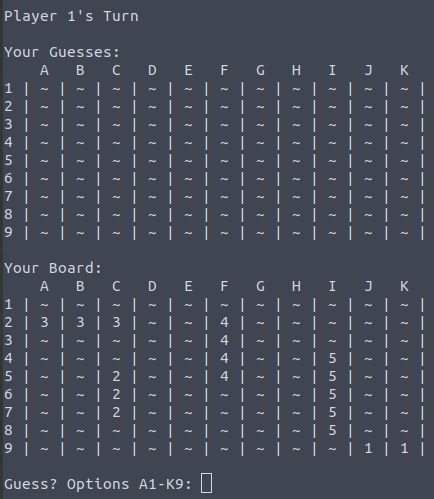

# Battleship.net
### Jack Mao, Casey May, Julian Stone

## Goals

Our goal for the project was to create a two player interactive experience through network connection in the terminal. Our final product has to have two individuals being prompted for inputs and allowing some sort of gameplay to take place. It has to utilize network socket creation in order to communicate between our two aforementioned terminals.

Our learning goals revolved around understanding network programming and proper ways to collaborate digitally. Because there is so much existing code on the internet that we could use as inspiration, we wanted to get a deep grasp of what it meant to create a network connection and what was required for terminal-terminal communication. On a side note, we were also motivated to learn structures that lend themselves to creating simple terminal based user interfaces, in this case specifically the utilization of two dimensional arrays. As far as digital collaboration, we wanted to learn how to traverse the world of Atom's Teletype. This software allows one host to invite other users to collaborate on their code and change things in real time, similar to the functionality of a shared google doc. We learned that this caused our commit history on Github to look rather interesting, as nearly all the commits came from one user, but this was a result of the fact that our group programming all took place on Teletype.
## Resources

We had a few primary sources of information from our project. Much of our early informational searching was done via a previous project, "HackerChat." Beyond that, there were multiple GeeksForGeeks articles that provided a great deal of vital information to make our network programming functional. These are linked here:

https://www.geeksforgeeks.org/socket-programming-cc/

https://www.geeksforgeeks.org/tcp-server-client-implementation-in-c/

Chapters 9 and 11 of Head First C were also helpful in allowing us to understand what some of the basics were behind this process, as for all of is this was basically our first interaction with server/client work.

## What Was Done

In this project, our aim is create the battleship game that can be played remotely between two players. Battle ship is a game wherein two players are given a 9 x 11 board and 5 ships. The ships are sized 1 x 1, 2 x 1, 3 x 1, 4 x 1, and 5 x 1, respectively. Without looking at each others' board, the two players randomly place the five ship on the board. Then, the players take turns, each guessing a block on the board in hopes that they have successfully "hit" the enemy ship. The first player to "hit" all of the opposing player's ships is the victor.  

To create the game, we first have to consider the essential components of our game. The most important aspects of our game are the network and the game rules. As such, we created the board.c file. The board.c file contains all of functions for creating the logic of the game, such as creating a board and adding ships to the board. The server.c file handles the server side operations through socket programming. All calculations for the board are done on the server. The client.c handles the client side operations and sends messages for the server to interpret. The network_board.c is a supporting file that contains functions to make board.c more network oriented in the server and client code.  







## Design Decision

In the very beginning, we wanted to create the battleship game with a server always running. The players would then connect to the server. However, we scrapped this idea due to several reasons. First, it was very difficult to do and we did not have the time to complete it. Second, it was an unnecessary measure since there are only two players involved. As such, we made the design decision that we wanted a player to host the server. So, the second player only needs to connect to the first player directly instead of using the roundabout way. In this way, the calculation will all be done on the first player's computer instead of a third party.

We also had several other ideas as we didn't really know how far we wanted to go with this project. So, we made three main waypoints for the project. The first is to have the game work on one person's computer. Then, we would want our game to work over the network. Lastly, we would like to have an A.I. that the player can play against. Our progress ended at the second waypoint because of time constraints.

## Code Implementation

### Data Storage
The first decision that needed to be made was the method on how we were going to store the data for each player. A battleship board consists of 9 rows and 11 columns. Each player has a board with their ships on it and another board that is keeping track of the players guesses. We decided that we could best store these in a struct

```c
typedef struct {
  int board[9][11];
  int guess[9][11];
  int ship_counts[5];
} Player;
```

The struct is called Player and it stores 2 two-dimensional arrays, one for the players actual board and one for the players guesses. Also, to save on run time later in the code, we decided to keep track of the ships and how many spaces each ship has that are not destroyed. This was held in an integer array where each index was a different ship and the number at that index was the number of spaces left.

### Network Implementation
Once we had the data structure situated, we needed to move onto getting two computers to communicate using a socket connection. The most basic implementation is quite standard and can be found in the resources listed above. For the sake of ease, below are two segments of the server and client code that are important to establishing the connection.
#### Server
```c
if (bind(server_fd, (struct sockaddr * )&address,
                             sizeof(address))<0)
{
    perror("bind failed");
    exit(EXIT_FAILURE);
}
if (listen(server_fd, 3) < 0)
{
    perror("listen");
    exit(EXIT_FAILURE);
}
if ((new_socket = accept(server_fd, (struct sockaddr * )&address,
                   (socklen_t*)&addrlen))<0)
{
    perror("accept");
    exit(EXIT_FAILURE);
}
```
#### Client
```c
if(inet_pton(AF_INET, serverAddr, &serv_addr.sin_addr)<=0)
{
    printf("\nInvalid address/ Address not supported \n");
    return -1;
}

if (connect(sock, (struct sockaddr * )&serv_addr, sizeof(serv_addr)) < 0)
{
    printf("\nConnection Failed \n");
    return -1;
}
```
The server code above is used to establish a new socket on a defined port on the IP address of the computer that is running the server. Once created, the socket waits for any possible connections. Upon finding a connection, it will accept the connection assuming the client trying to connect has the correct address credentials. For the client side, all it needs to do is validate the address given by the user then try and connect to the server hosting the socket.

Once the connection has been made between server and client, all that needs to be done at the minimum is use the `send()` and `read()` to send strings between the server and client. This is how we sent data between the programs as the server hosted a player and did the computations while the client would only host a player and give information back to the server. When doing this though, we ran into an interesting issue where one program would send a message before the other program began trying to read it. This is an issue because the `send()` command only sends the data once whereas the `read()` command will continually try and read the socket until something is sent. So to make sure the reading on one program isn't in an infinite loop, we delayed whichever side was sending for 10ms so the other side would have ample time to establish their reading state. This was done using the `usleep()` command. Most of our issues stemmed from incorrectly-timed `send()` commands, so this fix resolved most of the bugs we faced.

### Running the Game

The last piece of the puzzle was creating the code to run the actual game. This was done using a while loop in both the server and client files after each player's board was created. The server side while loop would continue to run as long as there was at least one ship with at least one space not destroyed. On every iteration of the loop, these are the steps that would be taken:

1. Check whose turn it is
2. Make a guess
  * If it is the client's turn, send messages to get the client's guess
  * Otherwise, ask the user of the client side to guess
3. Check again if the game is over, i.e. if one of the players has no remaining spaces

Once completed, the server will send a message to the client side signifying that the game is over. On the client side, the while loop is structured differently as it only ever really needs to make a guess when the server asks it to. So the client while loop will iterate half the number of times that the server while loop will iterate. So we must put the correct number of `read()` statements to collect what the server is sending to the client. Once the client reads the "Done" message, it will stop the loop and then read the winner from the server.

## Reflection

Our project ended at a place that felt very good as far as progress goes. Our lower bound was a player vs. simple AI game, that would have allowed us to have the server manage one player's moves. Our higher bound was a central server creation and two separate clients that would both alternate communication with the central server. Where we ended was with two terminals, one which acted as the server and one which acted as the client, but both of which allowed player input. All of our learning goals felt achieved, though to varying levels. Our team felt very comfortable with the use of Atom's Teletype add-on by the conclusion of our project's code. We also all understand network programming, although there is some variance in what extent that knowledge exists, as there always is, considering varying learning speeds. Because of this, we believe that all of our learning goals and project goals have been achieved, if not exceeded. If we were to repeat this project again in the future, one change that we would definitely incorporate would be to free the space taken up by all of our memory allocations by using the "free" function, as well as using the Trello board more actively rather than organizing purely with Facebook messenger.
